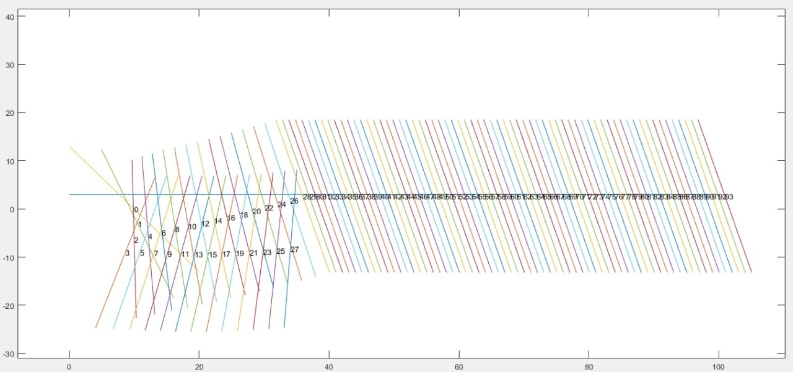

# Controle Simples de Lógica Fuzzy Para Robôs Seguidores de Linha

Trabalho realizado para a matéria TÓPICOS ESPECIAIS EM SISTEMAS DE PROGRAMAÇÃO VI - 2021.1
Universidade Federal Fluminense
**Docente**: Patrick Moratori
**Discentes**:  Marcos Augusto Nolasco do Amaral
                Patricia Martins Rocca Crestani
                Thales de Souza Machado

## Inforamações Iniciais

Este trabalho tem como objetivo desenvolver um controlador simples para guiar um robô seguidor de linha. Foram usados "dois sensores" que nas plotagens são dois pontos. A meta do controle Fuzzy é fazer com que o centro da reta que passa por esses sensores (os pontos) esteja sempre encima de uma linha reta, isto é, um y constante.

## Membership Functions

### Inputs

| Centro (de acordo com y) | Fizemos y = 3   |
| ------------------------ | :-------------: |
| Acima (AC)               | [3.099 , +100]  |
| No Centro (NC)           | [3.2  2.2]      |
| Abaixo (AB)              | [2.01 , -100]   |

| Ângulo [-90 , 90]            | Arcotangente do coeficiente angular da reta |
| -------------------------- | :-----------------------------------------: |
| Muito Grande Positivo (MG) | [60 , 90]                                   |
| Grande Positivo (GP)       | [15 , 60]                                   |
| Zerado (ZD)                | [15 , -15]                                  |
| Grande Negativo (GN)       | [-15, -60]                                  |
| Muito Grande Negativo (MN) | [-60 , -90]                                 |

### Outputs

| Ângulo de Correção [-25 , 25] | Usado para corrigir o ângulo do robô |
| --------------------------- | :----------------------------------: |
| Negativo Grande (NG)        | [-25, -9]                            |
| Negativo Pequeno (NP)       | [-10, 5]                             |
| Zero (ZE)                   | [-6, 6]                              |
| Positivo Pequeno (PP)       | [5, 10]                              |
| Positivo Grande (PG)        | [9, 25]                              |

### Regras

| Centro/Ângulo |  MG  |  GP  |  ZD  |  GN  |  MN  |
| :-----------: | :--: | :--: | :--: | :--: | :--: |
| AC            |  NG  |  NP  |  ZE  |  NP  |  PG  |
| NC            |  ZE  |  PP  |  ZE  |  NP  |  ZE  |
| AB            |  PG  |  PP  |  ZE  |  NG  |  NG  |

## Resultados 

O gráfico do resultado pode ser encontrado abaixo:

Nós começamos com um passo do robô avançando 10 unidades no eixo x, entretanto, com um valor tão alto, não foi possível fazer com o que o robô se estabilizasse. Diminuímos, entao para 1 unidade no eixo x a cada interação e com isso conseguimos resultados satisfatórios.
Perceba na imagem que o robô começa com um coeficiente angular negativo (enumeramos os passos que o robô deu, isto é, cada linha na imagem representa a posição do robô e cada número com esta linha representa a ordem daquela posição), ele corrige um pouco a sua rotação no instante 1, corrige mais um ponto no instante 2, entretanto, o centro fica bem abaixo da reta de equílibrio (isto é, y =3), ele tenta se corrigir no instante 3 e continua a abaixo, até que então se corrige de uma forma mais aceitável e faz sua rotação com um ângulo positivo, fazendo com que no isntante 4, ele fique mais próximo da reta. Entretanto, no instante 5 ele volta a descer e fica nesse zigue-zague por um tempo. Até conseguir se estabilizar no instante 28.

**Por que o robô demorou tanto a se estabilizar?**

Acreditamos que isto tenha ocorrido devido a quantidade de regras que criamos. As regras abrangem ângulos bem distante que com certeza variam de forma considerável a rotação realizada pelo robô. Se houvessem mais regras, que abrangessem ângulos menores, acreditamos que o robô conseguiria se estabilizar de maneira mais rápida e eficiente. Entretanto, devido ao tempo, não conseguimos gerar uma segunda versão das Membership Functions e das Regras.

**Por que o robô fica em diagonal?**

Isto ocorre porque o que estamos fazendo é tentar deixar sempre o centro da reta entre os dois sensores acima da reta y=3. Não nos preocupamos em deixar os sensores paralelos. Isto no mundo real seria um desastre, visto que o robô precisa andar em linha reta. Acreditamos que um output a mais que existisse apenas para corrigir a diferença entre os pontos *x*s dos sensores, isto não ocorreria. Entretanto, novamente, devido ao tempo, não foi possível realizarmos uma segunda versão do controle fuzzy.

## Conclusão

Ficamos muito contentes com o resultado. Inicalmente o robô seguia direções que não faziam o menor sentido. Mas logo percebemos que era mais uma questão de manipulação do MatLab do que erro nas nossas projeções. É claro que, como dito a cima, um output a mais e mais regras deixariam este controle muito mais eficiente e robusto, mas os resultados obtidos nos satisfizeram, pois, no final das contas, o robô usa a Lógica Fuzzy e consegue se estabilizar de maneira adequada. 
Foi muito interessante partir do papel e lápis (ou neste momento de pandemia, teclado e tela) e fazer algo desde o começo. Da captura do problema, a criação das hipóteses e modelos, criação das membership functions e regras, até ver o robôzinho seguir seu caminho. Ficamos muito contentes de ter realizado este trabalho.
Gostaríamos de agradecer ao discente Patrick Moratori que não nos deixou durante o semestre, mesmo com poucos alunos. Sempre disposto a ajudar e a lecionar da melhor maneira possível nesse momento tão complicado da academia e do mundo. 
Muito obrigado!